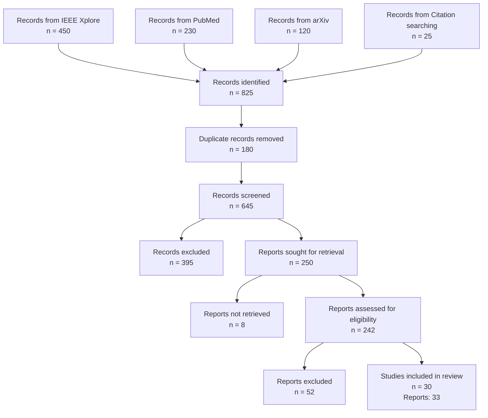

# PRISMA 2020 Flow Diagram

## Search Flow

## Detailed Breakdown

### Identification

**Database Searches:**

- **IEEE Xplore**: 450 records (searched: 2024-10-18)
- **PubMed**: 230 records (searched: 2024-10-18)
- **arXiv**: 120 records (searched: 2024-10-18)

**Other Sources:**

- **Citation searching**: 25 records

**Total Records Identified:** 825
**Duplicate Records Removed:** 180

### Screening

**Records Screened (title/abstract):** 645
**Records Excluded:** 395

**Exclusion Reasons:**

- Not relevant to topic: 320 records
- Not in English: 45 records
- Wrong publication type: 30 records

### Eligibility Assessment

**Reports Sought for Retrieval:** 250
**Reports Not Retrieved:** 8
**Reports Assessed (full-text):** 242
**Reports Excluded:** 52

**Exclusion Reasons:**

- Insufficient data: 35 reports
- Not peer-reviewed: 12 reports
- Duplicate publication: 5 reports

### Included

**Studies Included in Review:** 30
**Total Reports:** 33

---

*Generated: 2025-10-18 06:10:26*
*PRISMA 2020 compliant flow diagram*
